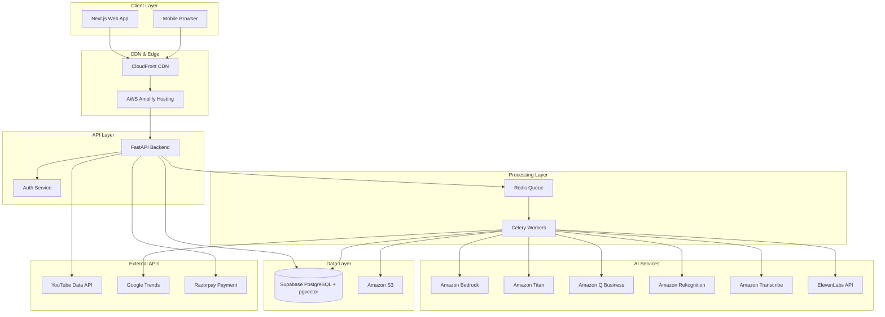

# Design Document: CreatorMind Platform

## Overview

CreatorMind is an AI-native platform architected as a microservices system leveraging AWS managed services for AI capabilities. The platform processes creator content through a pipeline of semantic analysis, predictive modeling, and multilingual production to deliver actionable intelligence and production-ready assets.

The system is designed for horizontal scalability, supporting growth from 100 to 50,000 users while maintaining sub-500ms API response times and 99.5% uptime.

## Architecture

### High-Level Architecture



### Technology Stack

**Frontend:**
- Next.js 14 with App Router
- React 18 with TypeScript
- TailwindCSS for styling
- Deployed on AWS Amplify

**Backend:**
- FastAPI (Python 3.11+)
- Celery for async task processing
- Redis for task queue and caching
- Deployed on AWS ECS Fargate

**AI Services:**
- Amazon Bedrock (Claude 3.5 Sonnet) for reasoning and labeling
- Amazon Titan Embeddings v2 for semantic vectors
- Amazon Titan Image Generator v2 for thumbnails
- Amazon Q Business for natural language explanations
- Amazon Rekognition for face detection and content moderation
- Amazon Transcribe for speech-to-text
- ElevenLabs Multilingual v2 for voice cloning

**Data:**
- Supabase PostgreSQL with pgvector extension
- Amazon S3 for video and asset storage
- Redis for caching and session management

**External Integrations:**
- YouTube Data API v3 and Analytics API
- Google Trends API
- Razorpay Payment Gateway

## Components and Interfaces

### 1. Authentication Service
- JWT tokens (24-hour expiration), bcrypt hashing (12 rounds)
- Email/password and Google OAuth support
- Rate limiting: 5 failed attempts per 15 minutes
- Password reset via email verification

### 2. YouTube Integration Service
- OAuth 2.0 with offline access for refresh tokens
- Fetch channel info, videos (last 50), transcripts, analytics
- Automatic token refresh on expiration
- Batch API requests to minimize quota usage
- Store tokens encrypted in database

### 3. Creator DNA Engine
- Extract transcripts (YouTube API → Amazon Transcribe fallback)
- Generate 1536-dim embeddings using Amazon Titan Embeddings v2
- Apply k-means clustering (k=5)
- Label clusters using Claude 3.5 Sonnet
- Store embeddings in pgvector for similarity search
- Auto-refresh every 14 days via Celery

### 4. Predictive Reach Scoring Engine
- Generate idea embedding using Amazon Titan
- Compute cosine similarity against DNA clusters
- Weight signals: semantic 40%, trends 30%, gap 20%, timing 10%
- Use Amazon Q Business for natural language reasoning
- Cache identical queries for 24 hours
- Target: 95% requests under 5 seconds

### 5. Regional Trend Intelligence Service
- Daily scraping via Celery scheduled task
- Filter by 9 languages and Indian states
- Cross-reference against 500+ creator benchmark database
- Store 90 days of historical data
- Calculate demand from search volume growth, supply from creator content volume
- Flag high-opportunity when demand > 70 AND supply < 30
- Notify users within 24 hours of new opportunities

### 6. Cultural Transposition Engine
- Maintain 200+ cultural context mapping entries
- Use Claude 3.5 Sonnet with cultural context prompts
- Identify and replace idioms, cultural references, region-specific terms
- Flag for human review when mapping unavailable
- Validate output length within 20% of source
- Support all 9 language pairs
- Store user feedback for mapping improvements

### 7. Voice Cloning Service
- Require minimum 5 minutes of clear audio samples
- Use ElevenLabs Multilingual v2 API
- Process enrollment within 10 minutes
- Generate 10-min dubbed audio within 3 minutes
- Preserve vocal characteristics (tone, pace, emotion)
- Synchronize timing within 5% variance
- Retry failed generations up to 3 times
- Store voice models encrypted at rest
- Reuse existing models rather than regenerating

### 8. Shorts Generation Service
- Identify segments using retention curve spikes and rewatch rates
- Extract exactly 3 clips of 30-60 seconds each
- Crop to 9:16 vertical format
- Use Amazon Rekognition for face detection and intelligent framing
- Center primary subject in frame
- Add auto-captions in video's language
- Preserve audio quality at minimum 128kbps
- Process 10-min video within 5 minutes

### 9. Thumbnail Generation Service
- Generate 3 variants using Amazon Titan Image Generator v2
- Apply styles: close-up, action shot, text-focused
- Use vibrant colors, output at 1280x720 resolution
- Incorporate video title with high-contrast fonts
- Analyze creator's top-performing thumbnails for style consistency
- Generate all 3 variants within 30 seconds
- Predict CTR based on historical performance
- Track selected thumbnail performance for model improvement

### 10. Feedback Loop Service
- Ingest data via YouTube Analytics API every 24 hours
- Retrieve views, watch time, CTR, retention
- Calculate accuracy delta between prediction and actual
- Trigger recalibration when delta exceeds 15 points
- Adjust weights based on signal correlation with success
- Personalize weights per creator
- Maintain 90-day accuracy history
- Update Creator DNA when videos significantly outperform/underperform

### 11. Production Workflow Orchestrator
- Accept MP4, MOV, AVI up to 2GB
- Execute pipeline: transcript → transposition → dubbing → shorts → thumbnails
- Process 10-min video in maximum 15 minutes
- Use Celery for async task orchestration
- Display progress with estimated completion time
- Continue with remaining steps if one fails
- Store assets in S3 with 90-day retention
- Package as ZIP with organized folder structure
- Implement retry logic with exponential backoff

### 12. Subscription and Payment Service
- Integrate Razorpay for UPI, credit/debit cards, net banking
- Auto-renew 24 hours before expiration
- Retry failed renewals 3 times over 7 days
- Downgrade to free tier after failed retries
- Generate GST-compliant invoices
- Lite: 10 predictions/day, no production
- Pro: 50 predictions/day, 7 productions/month
- Reset daily quotas at 00:00 IST, monthly on 1st
- Display warning at 80% quota usage
- Apply new limits immediately on upgrade

### 13. Notification Service
- Support email and in-app channels
- Use user's preferred language from profile
- Batch non-urgent notifications to max 1 email/day
- Send urgent notifications immediately (renewal failures, quota limits)
- Allow per-event-type preference configuration
- Store in-app notifications for 30 days
- Mark as read when user views

## Data Models

### User
```typescript
interface User {
  id: string
  email: string
  passwordHash: string
  displayName: string
  profilePictureUrl?: string
  preferredLanguage: string
  createdAt: Date
  lastLoginAt: Date
}
```

### YouTubeConnection
```typescript
interface YouTubeConnection {
  userId: string
  channelId: string
  channelName: string
  accessToken: string  // Encrypted
  refreshToken: string  // Encrypted
  tokenExpiresAt: Date
  connectedAt: Date
  lastSyncAt: Date
}
```

### Video
```typescript
interface Video {
  id: string
  userId: string
  youtubeVideoId: string
  title: string
  description: string
  publishedAt: Date
  duration: number
  thumbnailUrl: string
  transcript?: string
  embedding?: number[]  // 1536-dim vector
  clusterId?: string
}
```

### CreatorDNA
```typescript
interface CreatorDNA {
  userId: string
  clusters: {
    id: string
    label: string
    centroid: number[]
    videoIds: string[]
    avgPerformance: number
  }[]
  topFormats: string[]
  optimalTiming: {
    dayOfWeek: number
    hour: number
  }[]
  lastUpdated: Date
  nextRefresh: Date
}
```

### ReachPrediction
```typescript
interface ReachPrediction {
  id: string
  userId: string
  ideaText: string
  score: number
  reasoning: string
  recommendations: string[]
  signalBreakdown: {
    semanticSimilarity: number
    trendAlignment: number
    contentGap: number
    timing: number
  }
  createdAt: Date
  actualPerformance?: number
  accuracyDelta?: number
}
```

### Trend
```typescript
interface Trend {
  id: string
  topic: string
  language: string
  state: string
  searchVolume: number
  growthRate: number
  demandScore: number
  supplyScore: number
  opportunityScore: number
  scrapedAt: Date
}
```

### VoiceModel
```typescript
interface VoiceModel {
  id: string
  userId: string
  elevenLabsVoiceId: string
  status: 'processing' | 'ready' | 'failed'
  supportedLanguages: string[]
  audioSampleUrls: string[]
  createdAt: Date
}
```

### ProductionJob
```typescript
interface ProductionJob {
  id: string
  userId: string
  sourceVideoUrl: string
  targetLanguages: string[]
  status: 'queued' | 'processing' | 'completed' | 'failed'
  progress: number
  steps: {
    name: string
    status: string
    error?: string
  }[]
  assetUrls: {
    [language: string]: {
      dubbedVideo: string
      shorts: string[]
      thumbnails: string[]
      description: string
    }
  }
  createdAt: Date
  completedAt?: Date
}
```

### Subscription
```typescript
interface Subscription {
  userId: string
  plan: 'free' | 'lite' | 'pro'
  status: 'active' | 'cancelled' | 'expired'
  razorpaySubscriptionId?: string
  currentPeriodStart: Date
  currentPeriodEnd: Date
  autoRenew: boolean
  cancelledAt?: Date
}
```

### QuotaUsage
```typescript
interface QuotaUsage {
  userId: string
  resource: 'reach_score_predictions' | 'video_productions'
  period: 'daily' | 'monthly'
  used: number
  limit: number
  resetsAt: Date
}
```

### Database Schema Notes

- Use Supabase PostgreSQL for relational data
- Use pgvector extension for embedding storage and similarity search
- Index embeddings with HNSW for fast nearest neighbor search
- Partition large tables (videos, predictions, trends) by date
- Use connection pooling (min 20 connections per instance)
- Implement read replicas for query distribution
- Use Redis for caching frequently accessed data (1-hour TTL)

## Correctness Properties

A property is a characteristic or behavior that should hold true across all valid executions of a system—essentially, a formal statement about what the system should do. Properties serve as the bridge between human-readable specifications and machine-verifiable correctness guarantees.

### YouTube Integration Properties

Property 1: Video Fetch Completeness
*For any* successful YouTube authentication, fetching videos SHALL return up to 50 videos or all available videos if the channel has fewer than 50.
**Validates: Requirements 1.2**

Property 2: Token Cleanup on Revocation
*For any* creator who revokes YouTube access, the database SHALL contain zero OAuth tokens for that creator after revocation completes.
**Validates: Requirements 1.4**

### Creator DNA Properties

Property 3: Transcript Extraction
*For any* video with available YouTube transcripts, the system SHALL successfully extract the transcript text.
**Validates: Requirements 2.1**

Property 4: Embedding Dimensionality
*For any* transcript processed, the generated embedding SHALL have exactly 1536 dimensions (Amazon Titan Embeddings v2 standard).
**Validates: Requirements 2.3**

Property 5: Cluster Count Invariant
*For any* Creator DNA extraction, the system SHALL produce exactly 5 thematic clusters regardless of the number of input videos.
**Validates: Requirements 2.4**

Property 6: Cluster Labeling Completeness
*For any* thematic cluster generated, the cluster SHALL have a non-empty label string.
**Validates: Requirements 2.5**

Property 7: DNA Refresh Cadence
*For any* Creator DNA profile, the nextRefresh timestamp SHALL be exactly 14 days after lastUpdated.
**Validates: Requirements 2.6**

### Predictive Scoring Properties

Property 8: Input Validation
*For any* video idea submission, ideas with fewer than 20 characters SHALL be rejected, and ideas with 20 or more characters SHALL be accepted.
**Validates: Requirements 3.1**

Property 9: Embedding Generation
*For any* accepted video idea, the system SHALL generate a semantic embedding.
**Validates: Requirements 3.2**

Property 10: Cosine Similarity Bounds
*For any* similarity calculation between idea embedding and DNA clusters, the cosine similarity value SHALL be between -1 and 1 inclusive.
**Validates: Requirements 3.3**

Property 11: Signal Weight Sum
*For any* reach score calculation, the sum of signal weights (semantic similarity 40% + trend alignment 30% + content gap 20% + timing 10%) SHALL equal 100%.
**Validates: Requirements 3.4**

Property 12: Score Range Invariant
*For any* reach score generated, the score SHALL be between 0 and 100 inclusive.
**Validates: Requirements 3.5**

Property 13: Reasoning Presence
*For any* reach score generated, the reasoning field SHALL be non-empty.
**Validates: Requirements 3.6**

### Regional Trend Properties

Property 14: Language Filtering
*For any* trend stored in the database, the language SHALL be one of the 9 supported languages: Hindi, Tamil, Telugu, Bengali, Marathi, Kannada, Malayalam, Gujarati, or Punjabi.
**Validates: Requirements 4.2**

Property 15: Supply Score Calculation
*For any* trend processed, the supply score SHALL be calculated using data from the benchmark creator database.
**Validates: Requirements 4.3**

Property 16: High Opportunity Flagging
*For any* trend where demand score > 70 AND supply score < 30, the trend SHALL be flagged as high-opportunity.
**Validates: Requirements 4.4**

Property 17: Trend Ranking Order
*For any* list of trends returned, the trends SHALL be sorted in descending order by opportunity score.
**Validates: Requirements 4.5**

Property 18: Trend Data Retention
*For any* trend data older than 90 days, the data SHALL be deleted from the database.
**Validates: Requirements 4.6**

### Cultural Transposition Properties

Property 19: Cultural Reference Replacement
*For any* cultural reference in the mapping table, transposing content containing that reference SHALL replace it with the mapped equivalent for the target language.
**Validates: Requirements 5.3**

Property 20: Language Pair Support
*For any* combination of source and target languages from the 9 supported languages, the system SHALL successfully transpose content between them.
**Validates: Requirements 5.4**

Property 21: Review Flagging
*For any* content containing cultural references not in the mapping table, the transposed content SHALL have requiresReview set to true.
**Validates: Requirements 5.5**

### Voice Cloning Properties

Property 22: Audio Sample Validation
*For any* voice enrollment attempt, audio samples totaling less than 5 minutes SHALL be rejected.
**Validates: Requirements 6.1**

Property 23: Language Support
*For any* voice model created, the system SHALL support dubbing in all 9 platform languages.
**Validates: Requirements 6.3**

Property 24: Timing Synchronization
*For any* dubbed audio generated, the duration SHALL be within 5% of the original video duration.
**Validates: Requirements 6.4**

### Shorts Generation Properties

Property 25: Engagement Threshold
*For any* segment identified for Shorts extraction, the segment SHALL have an engagement score above the median engagement score for that video.
**Validates: Requirements 7.1**

Property 26: Clip Count and Duration
*For any* video processed for Shorts generation, the system SHALL produce exactly 3 clips, each with duration between 30 and 60 seconds inclusive.
**Validates: Requirements 7.2**

Property 27: Aspect Ratio Invariant
*For any* Short clip generated, the aspect ratio SHALL be 9:16 (vertical format).
**Validates: Requirements 7.3**

### Thumbnail Generation Properties

Property 28: Thumbnail Count
*For any* thumbnail generation request, the system SHALL produce exactly 3 thumbnail variants.
**Validates: Requirements 8.1**

Property 29: Style Diversity
*For any* set of 3 thumbnails generated, each thumbnail SHALL have a different style tag (close-up, action-shot, or text-focused), with no duplicates.
**Validates: Requirements 8.2**

Property 30: Resolution Invariant
*For any* thumbnail generated, the resolution SHALL be exactly 1280x720 pixels.
**Validates: Requirements 8.3**

Property 31: CTR Prediction Presence
*For any* thumbnail generated, the thumbnail SHALL have a predictedCTR value.
**Validates: Requirements 8.5**

### Feedback Loop Properties

Property 32: Accuracy Delta Calculation
*For any* prediction with actual performance data, the system SHALL calculate an accuracy delta value.
**Validates: Requirements 9.2**

Property 33: Recalibration Trigger
*For any* prediction where accuracy delta exceeds 15 points, the system SHALL trigger model recalibration for that creator.
**Validates: Requirements 9.3**

Property 34: Weight Adjustment
*For any* model recalibration, at least one signal weight SHALL change from its previous value.
**Validates: Requirements 9.4**

Property 35: Weight Personalization
*For any* two creators with different performance patterns, their signal weights after calibration SHALL differ.
**Validates: Requirements 9.5**

Property 36: Accuracy History Retention
*For any* accuracy record older than 90 days, the record SHALL be deleted from the database.
**Validates: Requirements 9.6**

### Authentication Properties

Property 37: Password Validation
*For any* password that does not contain at least 8 characters including uppercase, lowercase, number, and special character, the password SHALL be rejected.
**Validates: Requirements 10.2**

Property 38: Token Expiration
*For any* JWT token generated, the expiration time SHALL be exactly 24 hours from issuance.
**Validates: Requirements 10.3**

Property 39: Rate Limiting
*For any* user with 5 failed login attempts within 15 minutes, the 6th attempt SHALL be blocked.
**Validates: Requirements 10.4**

### Subscription Properties

Property 40: Renewal Timing
*For any* active subscription, renewal SHALL be attempted exactly 24 hours before the current period end date.
**Validates: Requirements 11.3**

Property 41: Retry Count
*For any* failed subscription renewal, the system SHALL retry exactly 3 times before downgrading the subscription.
**Validates: Requirements 11.4**

Property 42: Invoice GST Compliance
*For any* invoice generated, the invoice SHALL contain GST number, GST amount, and total amount fields.
**Validates: Requirements 11.5**

### Dashboard Properties

Property 43: Cluster Display Count
*For any* dashboard rendered, the Creator DNA visualization SHALL display exactly 5 thematic clusters.
**Validates: Requirements 12.2**

Property 44: Accuracy Trend Duration
*For any* dashboard rendered, the prediction accuracy trend SHALL display data for the last 90 days.
**Validates: Requirements 12.3**

Property 45: Trend Opportunity Count
*For any* dashboard rendered, the regional trends section SHALL display exactly 5 high-opportunity topics.
**Validates: Requirements 12.4**

### Production Workflow Properties

Property 46: File Format Validation
*For any* video upload, files with extensions MP4, MOV, or AVI and size ≤ 2GB SHALL be accepted, and all others SHALL be rejected.
**Validates: Requirements 13.1**

Property 47: Pipeline Step Execution
*For any* production job, all pipeline steps (transcript extraction, transposition, dubbing, shorts generation, thumbnails) SHALL be executed in order.
**Validates: Requirements 13.2**

Property 48: Asset Package Completeness
*For any* completed production job and target language, the asset package SHALL contain exactly 1 dubbed video, 3 Shorts clips, and 3 thumbnail variants.
**Validates: Requirements 13.4**

Property 49: Asset Retention
*For any* asset stored in S3, the asset SHALL be deleted exactly 90 days after creation.
**Validates: Requirements 13.5**

### Error Handling Properties

Property 50: Log Severity
*For any* error logged, the severity level SHALL be one of: DEBUG, INFO, WARNING, ERROR, or CRITICAL.
**Validates: Requirements 15.1**

Property 51: Critical Error Alerting
*For any* error logged with CRITICAL severity, an alert SHALL be sent to the operations team.
**Validates: Requirements 15.2**

Property 52: Error Rate Alerting
*For any* 5-minute window where error rate exceeds 5%, an alert SHALL be triggered.
**Validates: Requirements 15.4**

Property 53: Retry with Exponential Backoff
*For any* AI service failure, the system SHALL retry exactly 3 times with exponentially increasing delays between attempts.
**Validates: Requirements 15.5**

### Quota Management Properties

Property 54: Lite Quota Enforcement
*For any* Lite subscriber, the 11th reach score prediction request in a day SHALL be rejected with a quota exceeded error.
**Validates: Requirements 16.1**

Property 55: Pro Quota Enforcement
*For any* Pro subscriber, the 51st reach score prediction in a day OR the 8th video production in a month SHALL be rejected with a quota exceeded error.
**Validates: Requirements 16.2**

Property 56: Quota Error Message
*For any* quota exceeded error, the error message SHALL include the quota reset time.
**Validates: Requirements 16.3**

Property 57: Quota Reset Timing
*For any* daily quota, the quota SHALL reset at exactly 00:00 IST. For any monthly quota, the quota SHALL reset on the 1st day of the month at 00:00 IST.
**Validates: Requirements 16.4**

Property 58: Quota Warning Threshold
*For any* user who has consumed 80% or more of their quota, a warning SHALL be displayed.
**Validates: Requirements 16.5**

### Notification Properties

Property 59: DNA Refresh Notification
*For any* Creator DNA refresh that completes, a notification SHALL be sent to the creator.
**Validates: Requirements 17.2**

Property 60: Trend Notification Timing
*For any* high-opportunity trend detected for a creator's language, a notification SHALL be sent within 24 hours of detection.
**Validates: Requirements 17.3**

Property 61: Production Completion Notification
*For any* production job that completes, the notification SHALL include a download link for the assets.
**Validates: Requirements 17.4**

Property 62: Notification Preference Respect
*For any* notification event type where a creator has disabled notifications, no notification SHALL be sent for that event type.
**Validates: Requirements 17.5**

## Error Handling

### Error Categories
- **4xx Client Errors**: 400 Bad Request, 401 Unauthorized, 403 Forbidden, 404 Not Found, 429 Too Many Requests
- **5xx Server Errors**: 500 Internal Server Error, 502 Bad Gateway, 503 Service Unavailable, 504 Gateway Timeout

### Retry Strategies
- **AI Services**: Exponential backoff (1s, 2s, 4s, 8s), max 3 retries
- **YouTube API**: Respect quota limits, batch requests, cache 1 hour, deduplicate
- **Payments**: Retry renewals on Day 1, 3, 7 before downgrade

### Graceful Degradation
- **AI Services Down**: Use cached profiles, queue operations, display last sync time
- **YouTube API Down**: Use cached data, queue syncs, allow manual retry
- **Database Down**: Return 503, use Redis cache for reads, queue writes, alert ops

### Logging
- **Levels**: DEBUG (7d), INFO (7d), WARNING (30d), ERROR (90d), CRITICAL (90d)
- **Format**: Structured JSON with timestamp, level, service, requestId, userId, message, error, context

### Monitoring & Alerts
- **Critical (Immediate)**: Error rate > 5%, API p95 > 1000ms, DB failures, AI quota exhaustion, payment failures
- **Warning (15min)**: Error rate > 2%, API p95 > 500ms, queue depth > 100, cache hit < 70%, disk > 80%
- **Metrics**: Request rate/latency, error rates, AI costs, DB performance, queue depth, cache rates, quota usage

## Testing Strategy

### Dual Testing Approach
- **Unit Tests**: Specific examples, edge cases, error conditions, integration points. Mock external services.
- **Property Tests**: Universal properties across all inputs, minimum 100 iterations per test, comprehensive randomized coverage.

### Property-Based Testing
- **Python**: Hypothesis library, min 100 examples per test
- **TypeScript**: fast-check library, min 100 runs per test
- **Tag Format**: Feature: creatormind-platform, Property {number}: {property_text}
- All 62 correctness properties implemented as property tests

### Coverage Requirements
- Unit test coverage: 80% minimum, 100% for critical paths (auth, payment, quota)
- All error handling paths tested
- All 62 properties implemented and tagged

### Test Types
- **Integration Tests**: Complete request/response cycles, test DB with fixtures, mock external services
- **E2E Tests**: Critical journeys (YouTube → DNA → Scoring, Upload → Production → Download, Subscribe → Access → Renew)
- **Performance Tests**: Load (1000 concurrent users), stress (beyond capacity), endurance (24h normal load)
- **Security Tests**: Weekly AWS Inspector, dependency scanning, SAST/DAST, quarterly penetration testing

### CI/CD Pipeline
1. Commit → Lint → Unit tests → Property tests → Integration tests
2. Build Docker → Deploy staging → E2E tests
3. Manual approval → Deploy production → Smoke tests

### Test Execution Schedule
- Unit/Property tests: Every commit
- Integration tests: Every PR
- E2E tests: Staging deployment
- Performance tests: Weekly
- Security scans: Weekly
